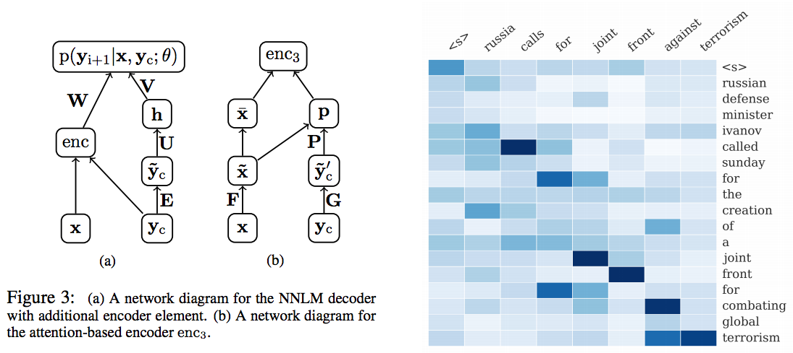

Attention-Based Summarization
=============================

Tensorflow implementation of [A Neural Attention Model for Abstractive Summarization](http://arxiv.org/abs/1509.00685). The original code of author can be found [here](https://github.com/facebook/NAMAS).

Prerequisites
-------------

- Python 2.7 or Python 3.3+
- [Tensorflow](https://www.tensorflow.org/)

Usage
-----

To train a model with `duc2013` dataset:

    $ python main.py --dataset duc2013

To test an existing model:

    $ python main.py --dataset duc2014 --forward_only True

References
----------

- [EMNLP 2015 slide](http://people.seas.harvard.edu/~srush/emnlp2015_slides.pdf)

Author
------

Taehoon Kim / [@carpedm20](http://carpedm20.github.io/)
